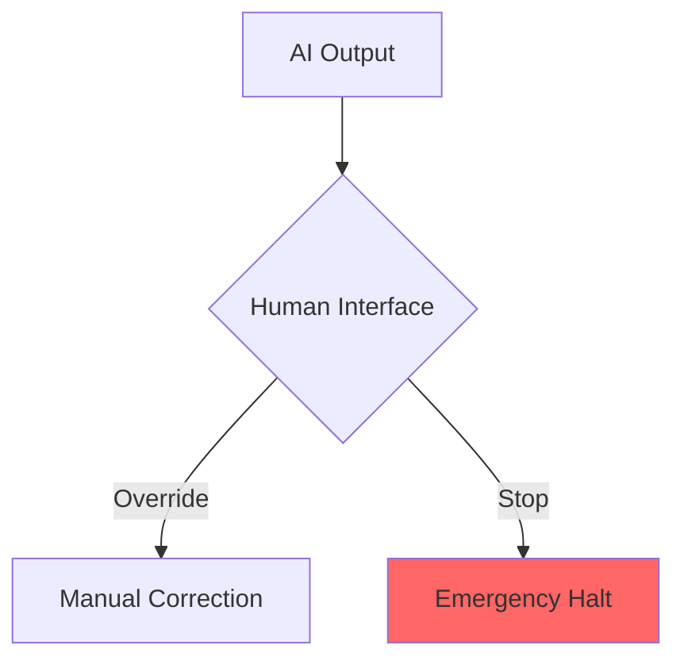

# Part 1: EU AI Act (Articles 9 - 20)
### Requirements for High-Risk AI Systems

---

### 1. Risk Management System (Art. 9)
**Tool:** [JSON Schema](https://json-schema.org/) | **File:** `risk_management_system.json`

```json
{
  "article": "9",
  "requirement": "Continuous iterative process",
  "steps": ["Identification", "Estimation", "Evaluation", "Mitigation"],
  "mitigation_priority": "Elimination > Substitution > Training/Info"
}
```
* **Pros:** Standardizes risk tracking; aligns with ISO 42001 (Control A.6).
* **Cons:** Can lead to "documentation fatigue" if not automated via CI/CD hooks.

---

### 2. Data & Data Governance (Art. 10)
**Tool:** [ML-Croissant](https://mlcommons.org/working-groups/data/croissant/) | **File:** `data_governance.json`

```json
{
  "article": "10",
  "checks": {
    "representative": true,
    "error_free_goal": "mitigated_to_state_of_art",
    "bias_detection": "demographic_parity_check",
    "provenance": "verified_lineage_v2"
  }
}
```
* **Pros:** Ensures high-quality training sets; provides a legal defense against bias claims.
* **Cons:** "Error-free" is a high bar; requires rigorous data cleaning and metadata tagging.

---

### 3. Technical Documentation (Art. 11 & Annex IV)
**Tool:** [Marp / Markdown](https://marp.app/) | **File:** `annex_iv_tech_doc.md`

> **Note:** Must include system architecture, algorithms, and computational resources used.

* **Pros:** Single source of truth for regulators; ensures transparency of logic.
* **Cons:** Requires constant updates; risk of exposing IP if not handled securely during audits.

---

### 4. Record-Keeping (Art. 12)
**Tool:** [OpenTelemetry](https://opentelemetry.io/) | **File:** `automated_logs.json`

```json
{
  "article": "12",
  "log_capabilities": {
    "period_of_operation": "continuous",
    "event_types": ["input_data", "output_decisions", "human_intervention"],
    "retention_policy": "6_months_minimum"
  }
}
```
* **Pros:** Automated traceability; critical for post-market surveillance.
* **Cons:** Massive data storage requirements; potential privacy/GDPR conflicts.

---

### 5. Transparency & Information (Art. 13)
**Tool:** [Model Cards](https://modelcards.withgoogle.com/) | **File:** `instructions_for_use.md`

* **Requirement:** Explain capabilities, limitations, and performance to the deployer.
* **Pros:** Improves user trust; reduces "automation bias" through clear warnings.
* **Cons:** Complex technical concepts must be translated for non-technical users.

---

### 6. Human Oversight (Art. 14)
**Tool:** [Mermaid.js](https://mermaid.js.org/) | **File:** `human_oversight.mmd`


* **Pros:** Legal safety net; prevents system autonomy from escalating errors.
* **Cons:** Humans are prone to "confirmation bias" or fatigue; interface design is critical.

---

### 7. Accuracy, Robustness & Cybersecurity (Art. 15)
**Tool:** [ART (Robustness Toolbox)](https://github.com/Trusted-AI/adversarial-robustness-toolbox) | **File:** `performance_specs.json`

```json
{
  "article": "15",
  "metrics": {
    "accuracy": "94.2%",
    "adversarial_resilience": "tested_against_fgsm",
    "security_plan": "CRA_aligned"
  }
}
```
* **Pros:** Quantifies reliability; establishes "state-of-the-art" security posture.
* **Cons:** Robustness metrics are highly dependent on the specific attack environment.

---

### 8. Obligations of Providers (Arts. 16 - 19)
**Tools:** [ISO 42001 Framework](https://www.iso.org/standard/81230.html) | **File:** `provider_declaration.json`

* **Art. 16:** Ensure compliance & CE marking.
* **Art. 17:** **Quality Management System (QMS)**—Must be documented in writing.
* **Art. 18:** **Documentation Retention**—Keep technical docs for 10 years.
* **Art. 19:** **Conformity Assessment**—Perform internal or third-party audits.

---

### 9. Corrective Actions (Art. 20)
**Tool:** [GitHub Actions](https://github.com/features/actions) | **File:** `incident_response.yml`

* **Requirement:** Immediately bring non-compliant systems into conformity or withdraw them.
* **Pros:** Fast reaction time to harmful AI behaviors.
* **Cons:** Automated "kill switches" can disrupt critical business operations.

---

# Part 2: Cyber Resilience Act (CRA)
### Essential Security Requirements

---

### 10. Security-by-Design (CRA Annex I)
**Tool:** [OWASP ASVS](https://owasp.org/www-project-standard/) | **File:** `secure_design_audit.json`

* **Requirement:** No known exploitable vulnerabilities; secure default configurations.
* **Pros:** Reduces attack surface significantly before the product hits the market.
* **Cons:** Hard to prove "zero vulnerabilities" in complex, dynamic software.

---

### 11. Vulnerability Handling (CRA Art. 10)
**Tool:** [CycloneDX (SBOM)](https://cyclonedx.org/) | **File:** `bom.json`

```json
{
  "framework": "CRA",
  "component_tracking": "SBOM_v1.5",
  "vulnerability_policy": "24h_early_warning_reporting"
}
```
* **Pros:** Full supply chain visibility; mandatory for CE marking.
* **Cons:** Tracking thousands of sub-dependencies creates a "wall of alerts."

---

### 12. Support & Updates (CRA Art. 13)
**Tool:** [VEX (Vulnerability Exploitability eXchange)](https://cyclonedx.org/capabilities/vex/) | **File:** `update_policy.json`

* **Requirement:** Provide security updates for the duration of the "expected product lifetime."
* **Pros:** Ensures long-term safety of deployed systems.
* **Cons:** Financial burden of maintaining legacy software for several years.

---

# Final Summary Table

| Article | Requirement | Tool Recommendation |
| :--- | :--- | :--- |
| **Art 9** | Risk Mgmt | JSON Schema |
| **Art 10** | Data Gov | ML-Croissant |
| **Art 12** | Logging | OpenTelemetry |
| **Art 14** | Human Oversight | Mermaid.js |
| **Art 17** | QMS | ISO 42001 / GitHub Actions |
| **CRA** | Security | CycloneDX (SBOM) |